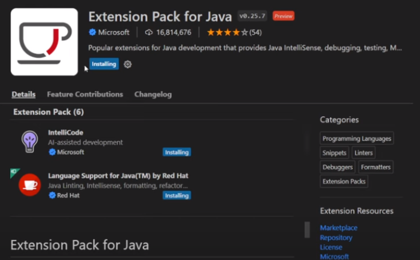
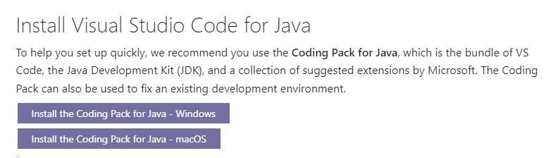
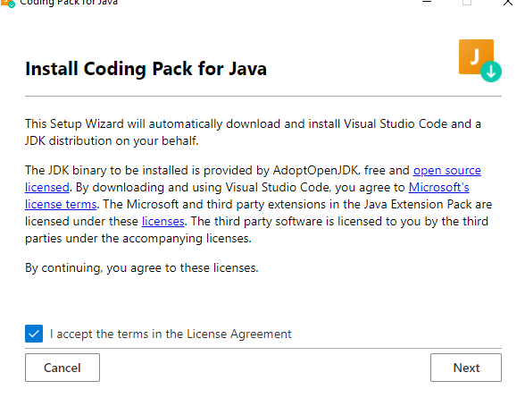
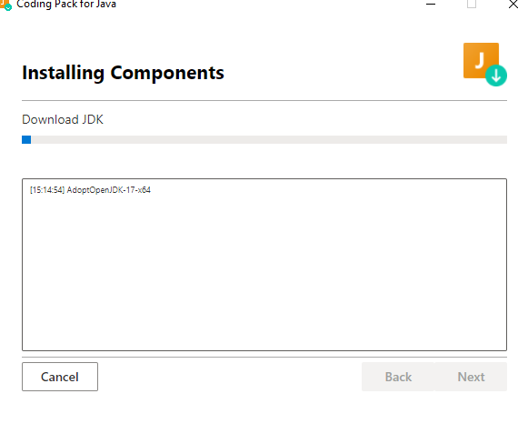
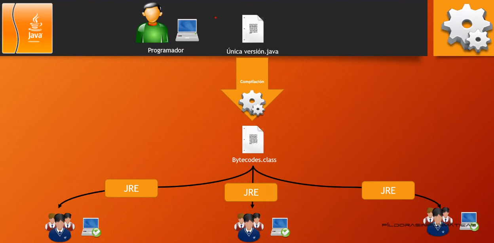

# Curso de JAVA

## Entornos de Desarrollo usaremos Visual Studio Code

- El que vamos a utilizar es Visual Estudio Code como IDE
- Para su instalacion debemos de instalar las siguientes extensiones

# Extensiones

- Una vez instaladas las extensiones Instalar el JDK
 

- Luego probamos

> Si esto no funciona o no los lleva a instalar JDK, hacemos los siguiente:

- Hacemos click [en este link](https://code.visualstudio.com/docs/languages/java):

- En la documentacion bajamos hasta el "Coding Pack", seleccionamos el Pack para Windows (Si tienes Mac seleccionamos para Mac)

- Esperamos que descargue el pack

- Instalamos

- Y listo, si aun no instalamos las extensiones las instalamos de nuevo.
> Si sigue sin funcionar, reiniciamos y volvemos a abrir el VSC

## Que es JDK ?

Se trata de un paquete de software que puede utilizar para desarrollar aplicaciones basadas en Java. El Entorno de ejecución de Java es un complemento necesario para ejecutar programas de Java. Java Development Kit es necesario para desarrollar aplicaciones de Java.

## Que es JRE ?

JRE = Java Runtine Enviroment (Entorno de ejecucion de Java)

- Por que es necesaria su instalacion ?
    - Porque la principal caracteristica de Java es ser multiplataforma
    - Este caracter de Java de ser multiplataforma implica que el programa escrito en Java debe ser "compilado"
      para posteriormente sea "Interpretado" por la JRE

## Que es compilar ?
El codigo fuente es en el cual le damos instrucciones a la maquina para que haga determinadas cosas, este lenguaje es entendido por los humanos (programadores).
Es importante saber que las maquinas no entienden Codigo Fuente, solo codigo binario.
El Compilador lo que hace es convertir el codigo fuente en codigo maquina (binario), de ahi la maquina entiende ese lenguaje.

- Por ejemplo: Estamos programando en Pascal. El compilador, una de las alternativas es crear un ejecutable en **.exe** pero solo se podria ejecutar en Windows
    Para que se ejecute en otros sistemas operativos deberiamos crear una version del ejecutable en Linux, Windows, Mac

- Solucion de Java  
Con Java lo que hacemos es crear un codigo fuente con extension .java y al compilar, compila un fichero de extesion .class que no llega a ser codigo maquina, ni tampoco codigo fuente pero es un itermediario llamado "Bytecodes"
A este fichero de Bytecodes se le aplica la maquina virtual de Java (JRE)

> Esa es la ventaja de Java, puede ejecutarse en cualquier SO,
> La desventaja es que necesitamos tener instalado la JRE para su ejecucion, sea cual sea la plataforma

## Diferencias entre el JRE, la JVM y el JDK
El JDK lo compila y transfiere el código de bytes al JRE. Por el contrario, el JRE contiene bibliotecas de clases, que respaldan los archivos, y la JVM. Utiliza estos componentes de software para ejecutar el código intermedio en cualquier dispositivo.

# Introduccion a Java

## Muy breve historia

Java nace en el año 1991 por Sun Microsystems, con el fin de poder utilizar en todos los electrodomesticos, para ello debia a ser Codigo pequeño, compacto y neutro respecto a la arquitectura para que se pueda adaptar a los dispositivos futuros.
Sin embargo fue un fracaso porque no la pudieron vender de 1992 a 1994 y quedo en el Stand-by

## Alternativa

En 1996 se les ocurrio que se podia comerciar el lenguaje JAVA por internet o enfocarlo a internet ya que Java se podia adaptar al mismo.
Decidieron crear un navegador llamado HotJava,  el cual era ligero y podia ejecutar codigo en su interior. 
Pero tenia muchas limitaciones y los programadores no lo tomaban en serio pero con el tiempo crearon paquete o clases el cual impulso su uso.

## Características de JAVA

- **Sencillo:** En el sentido se quito caracteristicas que tenian otros lenguajes (aritmética de punteros, ficheros de encabezados etc) y sobre todo es más ligero

- **Orientado a Objetos:** Es el lenguje más orientado a objetos que existe
- **Distribuido:** Buen tratamiento de redes, buena programación para internet
- **Seguro:** Como fue pensado para programar en red se hizo seguro
    > No tanto, todos los lenguajes tienen vulnerabilidades, lo cual debemos actulizar la maquina virtual y sobre todo saber cyber seguridad
- Es seguro porque no permite:
        - Leer o escribir sin permiso
        - Desbordar la pila de ejecución
        - Corrupción de memoria
- **Neutro:** Con respecto al hardware, es multiplataforma
- **Adaptable:** Tipo de datos primitivos iguales en todas las plataformas
- **Interpretado:** Se compila y despues se interpreta
- **Alto rendimiento** 
- **Multi-hilo:** Se puede trabajar con varios procesos en un mismo programa JAVA 

## Ideas erróneas
- **JAVA no es una extensión de HTML**
- **JAVA no tiene nada que ver con JavaScript (Solo comparten parte del nombre y sintaxis parecida)**
- **Todos los programas de Java se ejecutan en una pagina web (solo los applets)**
- **JAVA es inseguro**
- **JAVA es 100% seguro**
 
 
 

<< [Volver al Home](https://github.com/MONZONPUNTOEXE/java-programming/blob/main/README.md) | [Siguiente Capítulo](https://github.com/MONZONPUNTOEXE/java-programming/blob/main/2-Estructuras-principales-del-lenguaje/readme.md) >>

