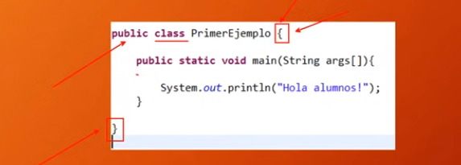
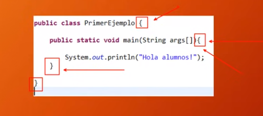

# Estructuras principales del lenguaje
## Tipos de programas que podemos hacer en JAVA

- Aplicaciones de consola
- Aplicaciones de proposito general
- Aplets

## Diferencias

- Aplicaciones de consola: Estas aplicaciones se ejecutan en la consola
- Aplicaciones de proposito general: Aplicaciones que se ejecutan en la Desktop
- Aplets: Son programas creados en Java que se ejecutan dentro de un navegador

## Anatomía de un programa Java
- Para poder hacer un print o imprimir por consola una cadena de texto se hace de esta manera:

```java
public class primerEjemplo{
    public static void main(String args[]){
        System.out.printIn("Hola alumnos!");
    }
    }

```

> Java es **Case Sensitive**: Significa que java distingue entre minusculas y mayusculas

> Esta es la estructura de código, más adelante aprenderemos que significa cada cosa, por ahora solo debemos escribir código de esta manera por convención.

Por ahora debemos saber que:
- **public**: Es un modificador de acceso
- **class**: Quiere decir que el código esta dentro de una clase.
> Importante: Todo programa Java tiene que estar dentro de al menos, una clase.

- Las llaves *{ }*: Delimitan de donde empieza y termina las **clases**, los **metodos**, los **bucles** y otros bloques de código.


- Toda llave que se abre se tienen que cerrar



- Tienen que tener un orden 
- Las llaves, para diferenciarlas de donde empieza y termina la llave central. A la segunda llave se le puede agregar una sangria para diferenciarla a la llave central.
> Esto es por convencion, el código funcionara igual sin esto. Pero hay que aclarar que el código siguiendo esta estructura sera más legible 


## Nuestro primer programa

- Vamos a nuestro Visual Studio Code

Si ya tenemos instalado las extensiones que estan en [introduccio a Java](https://github.com/MONZONPUNTOEXE/java-programming/tree/main/Introduccion-a-java).
Creamos un nuevo archivo en nuestra carpeta del proyecto en formato **.java**

> Las clases deben empezar con mayusculas
> Las clases no tienen que tener espacios
> Las clases no tienen que tener caracteres especiales
