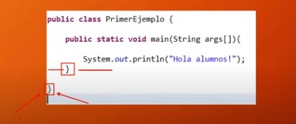
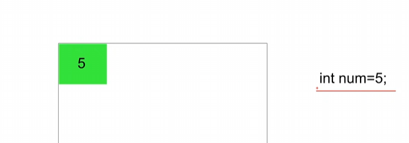
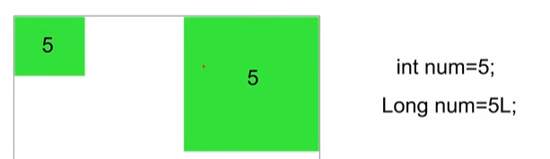
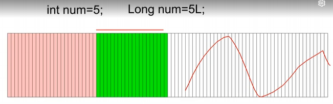
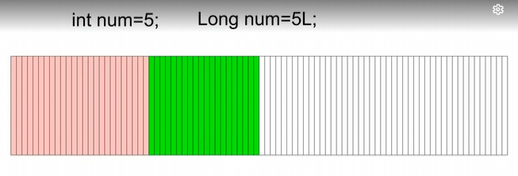
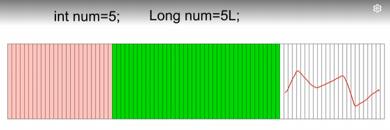

# Índice
- [Estructuras Principales del Lenguaje](#estructuras-principales-del-lenguaje)
    - Anatomia
    - Diferentes Aplicaciones
    - llaves, case sensitive
    - Primer programa
- [Estructuras Principales del Lenguaje II](#estructuras-principales-del-lenguaje-ii)

# Estructuras principales del lenguaje
## Tipos de programas que podemos hacer en JAVA

- Aplicaciones de consola
- Aplicaciones de proposito general
- Aplets

## Diferencias

- Aplicaciones de consola: Estas aplicaciones se ejecutan en la consola
- Aplicaciones de proposito general: Aplicaciones que se ejecutan en la Desktop
- Aplets: Son programas creados en Java que se ejecutan dentro de un navegador

## Anatomía de un programa Java
- Para poder hacer un print o imprimir por consola una cadena de texto se hace de esta manera:

```java
public class primerEjemplo{
    public static void main(String args[]){
        System.out.printIn("Hola alumnos!");
    }
    }

```

> Java es **Case Sensitive**: Significa que java distingue entre minusculas y mayusculas

> Esta es la estructura de código, más adelante aprenderemos que significa cada cosa, por ahora solo debemos escribir código de esta manera por convención.

Por ahora debemos saber que:
- **public**: Es un modificador de acceso
- **class**: Quiere decir que el código esta dentro de una clase.
> Importante: Todo programa Java tiene que estar dentro de al menos, una clase.

- Las llaves *{ }*: Delimitan de donde empieza y termina las **clases**, los **metodos**, los **bucles** y otros bloques de código.


- Toda llave que se abre se tienen que cerrar


- Tienen que tener un orden 
- Las llaves, para diferenciarlas de donde empieza y termina la llave central. A la segunda llave se le puede agregar una sangria para diferenciarla a la llave central.
> Esto es por convencion, el código funcionara igual sin esto. Pero hay que aclarar que el código siguiendo esta estructura sera más legible 



## Nuestro primer programa

- Vamos a nuestro Visual Studio Code

Si ya tenemos instalado las extensiones que estan en [introducción a Java](https://github.com/MONZONPUNTOEXE/java-programming/tree/main/Introduccion-a-java).
Creamos un nuevo archivo en nuestra carpeta del proyecto en formato **.java**

> Las clases deben empezar con mayusculas
> Las clases no tienen que tener espacios
> Las clases no tienen que tener caracteres especiales
> Las clases pueden tener numeros pero al final
> Si estas usando Visual Studio Code las class se generan automaticamente

- Todo nuestro programa debe estar dentro de las llaves de la class


Tenemos **public** que es el modificador de acceso <br>
Tenemos el **class**<br>

```java
public class iniciandoEnJava{ //abrimos 1er llave
    // Creamos el public void main, luego explicaremos para que sirve
    public static void main(String args[]){ //abrimos 2da llave
    } // cerramos 2da llave
} // cerramos 1er llave
```
- Ahora vamos a imprimir algo por pantalla con el metodo System.out.println()
- Dentro vamos a poner una cadena de texto "Hola Alumnos"
- Respetar siempre las minusculas, mayusculas y cerrar la sentencia con **;**


```java
public class iniciandoEnJava{ //abrimos 1er llave
    // Creamos el public void main, luego explicaremos para que sirve
    public static void main(String args[]){ //abrimos 2da llave
        System.out.println("Hola alumnos!");
    } // cerramos 2da llave
} // cerramos 1er llave
```
> Cuando compilemos el programa nos creara un archivo **.class** ese archivo es el **bytecodes** que es un archivo con un lenguaje que no es ni de maquina ni de programación que va a ser interpretado por la **JRE**

# Estructuras Principales del Lenguaje II

## Tipos de datos en Java (Tipos primitivos)
- Enteros
    - Int: 4 bytes de espacio de almacenamiento. Desde -2,147,483,648 haste 2,147,483,647
        > Ejemplo: El número 7 o 1,500,569 esta entre ese rango, entonces es un dato de tipo **int**
    - Short: 2 bytes de espacio de almacenamiento. Representan números desde -32,768 hasta 32,767
        > Ejemplo: El número 7 tambien podria ser considerado de tipo **Short**, Sin embargo el número 1,500,569 no puede ser considerado **Short**
    - Long: 8 byte de espacio de almacenamiento. Representan números (Muchos números). Sufijo L
        > Ejemplo: Debemos especificar que el dato que estamos ingresando es de tipo long con un sufijo de esta manera: **5000000000L** el lenguje interpretara que es de tipo **Long**
    - Byte: 1 byte de espacio de almacenamiento. Representan números desde -128 hasta 127
        > Ejemplo: El número 35 podria ser considerado por todos los tipos de datos enteros desde el **(Byte, Long,Short, Int)**
- Coma flotante (decimales)
    - Float: 4 bytes de espacio para almacenamiento. Aprox. 6 a 7 cifras decimales significativas. Sufijo F.
    > Debemos especificar que el dato que estamos ingresando es de tipo Float con una F al final
    > Ejemplo: 2.25F
    - Double: 8 bytes de espacio para almacenamiento. Aprox. 15 cifras decimales significativas.
    - Char: Para representar cualquier caracter (Unicode)
- Boolean: True, False (Para evaluar condiciones)

### Y los datos de tipo fechas, y los datos de tipo texto ?
> Estos datos en Java no son considerados tipo primitivo sino, objeto
> Por ejemplo: Las fechas en Java son considerados objetos de tipo **Date**
> Las cadenas de texto son considerados objetos de tipo **String**

### Variables en Java

- Qué es una variable: Espacio en la memoria del ordenador donde se almacenara un valor podrá cambiar durante la ejecución del programa

- Por qué hay que utilizar variables? Porque a la hora de crear un programa surge la necesidad de guardar datos temporalmente que necesitarás utilizar en el futuro en ese mismo programa
- Como se crea una variable en Java?: Especificando el tipo de dato que almacenará en su interior + el nombre de la variable.
> Ejemplo: intsalario;
- Que es iniciar una variable ?: Es darte un valor. Nombre_variable = valor
> Ejemplo salario = 2000;
- Java no permite utilizar variables que no se hayan iniciado
> Nota: Java no permite utilizar variables que no se hayan iniciado (Es decir que no le asignamos valor). Java es estricto con los tipos de datos y la declaracion de variables.

## Pequeño gráfico de como se declaran las variables

- Todas las variables se alojan en la RAM. 
- La RAM es una **memoria volatil**, es decir, cuando se apaga el ordenador la ram queda vacía
- Cuando iniciamos el ordenador, utiliza la RAM para procesos internos, los programas van ocupando un poco de espacio en la RAM a medida que vamos abriendo programas.
- Si estamos programando no sabemos cuanta memoria disponible tenemos, con los programas que tenemos en segundo plano y los procesos interno del SO
- Tenemos que saber que es lo que pasa en la RAM a la hora de programar, para que nuestro programa sea optimo, no tenga lentitud ni desborde


- Si nosotros hacemos zoom a nuestra RAM, si solo declaramos una variable de tipo **INT**, solo reservamos el espacio en la RAM 
- Si nosotros declaramos una variable y asignamos valor, reservamos el espacio en la RAM y se le asigna el valor dentro de ese espacio en la RAM
> Recordemos que **INT** es un tipo de dato que puede almacenar numeros desde -2,147,483,648 haste 2,147,483,647 y ocupan 4 bytes de espacio



- Si nosotros declaramos una variable de tipo **LONG** va a ocupar un espacio mucho mayor a diferencia al **INT**



- Vemos que se utiliza demasiado espacio para un numero que no lo necesita, esto quiere decir que no estariamos aprovechando los recursos adecuadamente.
- En este caso podriamos usar el tipo de dato **byte** 

```java
    byte num = 5;
```
- A la hora de programar tenemos que ser estrictos con el tamaño de los datos, pero como hoy en dia las computadoras son potentes no tenemos que preocuparnos por ello
- Cuando queremos declarar una variable y va a tener como dato un **5**, podemos usar por convencion el **INT**, es verdad que ocupa mas espacio pero el computador no lo va a notar si tu programa no es muy complejo
> Esto no quiere decir que no podamos usar el byte o el short si lo quisieramos

- Si nosotros tenemos un programa que tiene 2mil variables de datos enteros de tipo **INT**, estariamos utilizando aprox. esta cantidad de RAM:



- Nos quedara todo el espacio que esta en blanco para poder utilizar mas procesos 



- Si utilizamos **LONG** en todas las variables, tendriamos menos espacio disponible en la RAM y estariamos consumiento muchos recursos de nuestro PC
- Esto se traduce en mas lentitud en el programa JAVA por estar consumiendo muchos recursos de la RAM y poco rango de RAM libre para que funcionen, procesos en segundo plano, aplicaciones abiertas y etc



- Como dijimos anteriormente las computadoras de hoy en dia son potentes, podemos utilizar

    - **int**: Para datos enteros, a no ser que vayamos a representar numeros superiores a 2,147,483,647 o inferior -2,147,483,648
    - **double**: Para datos con numeros decimales
    - **char**: Para datos de tipo char
    - **boolean**: Para datos logicos


<br>
<br>
<br>

<< [Capítulo Anterior](https://github.com/MONZONPUNTOEXE/java-programming/blob/main/1-Introduccion-a-java/readme.md) | [Siguiente Capítulo](.) >>
