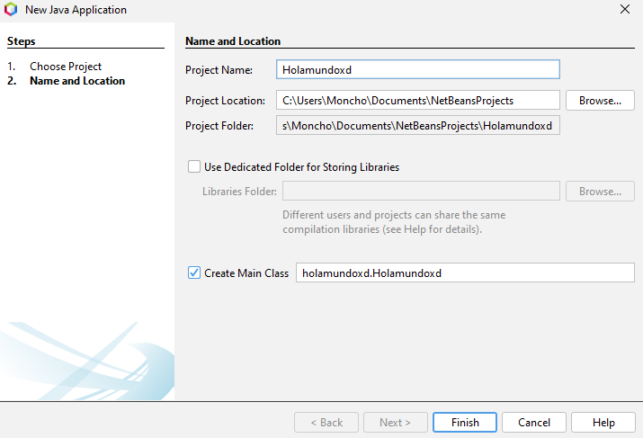
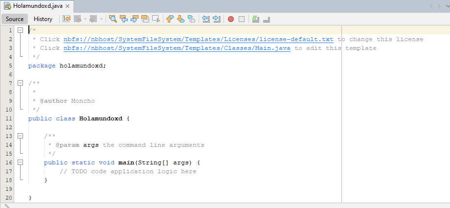

# Creamos proyecto nuevo

1. Nos dirigimos a Netbeans luego en File > New Project
2. Seleccionamos Java Ant y Java Application 

3. Nombre de proyecto en este caso "Hola mundo" y luego finish

4. Tenemos todo nuestro proyecto creado listo para poder codear.



5. Podemos borrar los comentarios y empezar a programar

6. Vamos a usar una función para imprimir por pantalla

````java
// Esta es nuestra clase
public class Holamundoxd {

   
    public static void main(String[] args) {
        // Dentro de este metodo podemos poner nuestra función para imprimir por pantalla

        // Escribimos la palabra "sout" y apretamos la tecla tab y nos escribe la funcion que queremos

    System.out.println("Hola muuuuundo");
        // Con esta función podemos imprimir por pantalla
        
    }
````


<br>
<br>
<br>

<< [Capítulo Anterior](https://github.com/MONZONPUNTOEXE/java-programming/blob/main/1-Introduccion-a-java/readme.md) | [Siguiente Capítulo](.) >>
