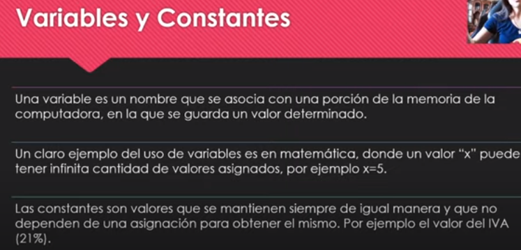
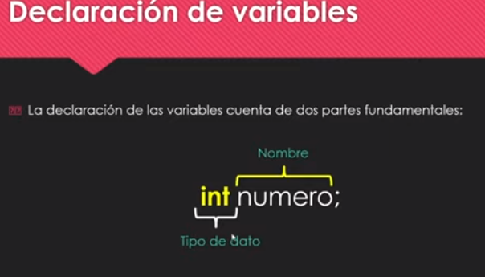

# Creamos proyecto nuevo

1. Nos dirigimos a Netbeans luego en File > New Project
2. Seleccionamos Java Ant y Java Application 

3. Nombre de proyecto en este caso "Hola mundo" y luego finish

4. Tenemos todo nuestro proyecto creado listo para poder codear.


5. Podemos borrar los comentarios y empezar a programar

6. Vamos a usar una función para imprimir por pantalla

````java
// Esta es nuestra clase
public class Holamundoxd {

   
    public static void main(String[] args) {
        // Dentro de este metodo podemos poner nuestra función para imprimir por pantalla

        // Escribimos la palabra "sout" y apretamos la tecla tab y nos escribe la funcion que queremos

    System.out.println("Hola muuuuundo");
        // Con esta función podemos imprimir por pantalla
        
    }
````

### Variables y Constantes




### Tipos de datos


### Declaración de variables



### Creamos un proyecto nuevo

- De esta forma declaramos las diferentes variables

````java
package mis.variables;

public class MisVariables {
    
    public static void main(String[] args) {
        // NUMEROS:
        //declarar variable: tipo de dato + nombre de varible
        int numeros = 5;
        // Asignar el valor con el igual
        // Importante: Cerrar siempre con punto y coma
        
        // CADENAS DE TEXTO:
        // Importante: A la cadena de texto se tiene que asignar con comillas dobles, no con simples
        String mascota = "brisa";
        
        // TEXTO CON UN CARACTER:
        // Variable de tipo ·char· para un solo caracter
        // Importante: Cuando es de un solo caracter es con comillas simples
        char letra = 's';
        
        // NUMEROS CON COMA:
        double temperatura = 27.5;
        
        // BOLEANOS:
        boolean siONo = false;
        
        // NUMEROS LARGOS
        long largo = 123456789;        
    }
    
}

````

````java

````


<br>
<br>
<br>

<< [Capítulo Anterior](https://github.com/MONZONPUNTOEXE/java-programming/blob/main/1-Introduccion-a-java/readme.md) | [Siguiente Capítulo](.) >>
