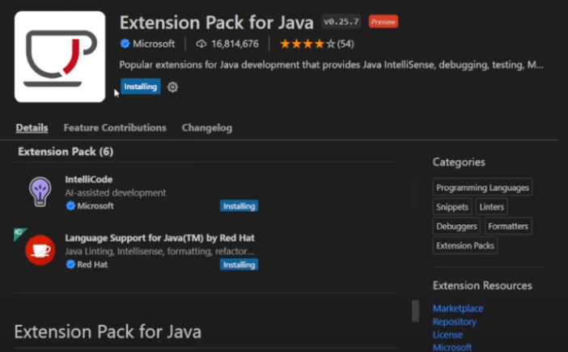
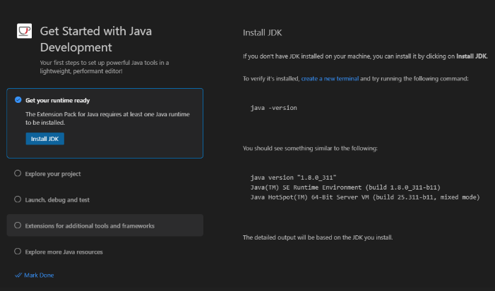
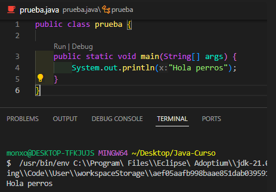
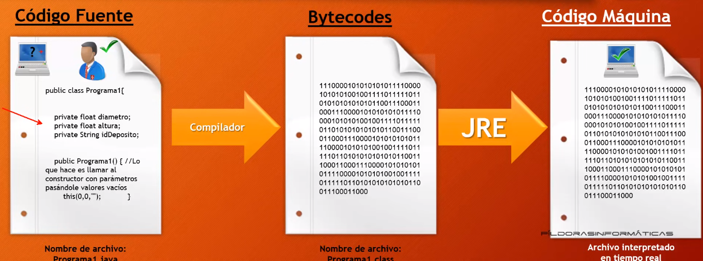

# Curso de JAVA

## Entornos de Desarrollo usaremos Visual Studio Code

- El que vamos a utilizar es Visual Estudio Code como IDE
- Para su instalacion debemos de instalar las siguientes extenciones

# Extensiones

- Una vez instaladas las extensiones Instalar el JDK
 

- Luego probamos

## Que es JRE ?

JRE = Java Runtine Enviroment (Entorno de ejecucion de Java)

- Por que es necesaria su instalacion ?
    - Porque la principal caracteristica de Java es ser multiplataforma
    - Este caracter de Java de ser multiplataforma implica que el programa escrito en Java debe ser "compilado"
      para posteriormente se "Interpretado" por la JRE

- Que es compilar ?
El codigo fuente es en el cual le damos instrucciones a la maquina para que haga determinadas cosas, este lenguaje es entendido por los humanos (programadores)
Es importante saber que las maquinas no entienden Codigo Fuente, solo codigo binario
El Compilador lo que hace es convertir el codigo fuente en codigo maquina (binario), de ahi la maquina entiende ese lenguaje.

- Por ejemplo: estamos programando en Pascal, el compilador una de las alternativas es crear un ejecutable en .exe pero solo se podria ejecutar en Windows
    Para que se ejecute en otros sistemas operativos deberiamos crear una version del ejecutable en Linux, Windows, Mac

- Solucion de Java
Con Java lo que hacemos es crear un codigo fuente con extension .java y al compilar, compila un fichero de extesion .class que no llega a ser codigo maquina, ni tampoco codigo fuente pero es un itermediario llamado "Bytecodes"
A este fichero de Bytecodes se le aplica la maquina virtual de Java (JRE)

> Esa es la ventaja de Java, puede ejecutarse en cualquier SO,
> La desventaja es que necesitamos tener instalado la JRE para su ejecucion, sea cual sea la plataforma

# Introduccion a Java

Java nace en el a año 1991 por Sun Microsystems, con el fin de poder utilizar en todos los electrodomesticos, para ello debia a ser Codigo pequeño, compacto y neutro respecto a la arquitectura para que se pueda adaptar a los dispositivos futuros.
Sin embargo fue un fracaso porque no la pudieron vender de 1992 a 1994 y quedo en el Stand-by

